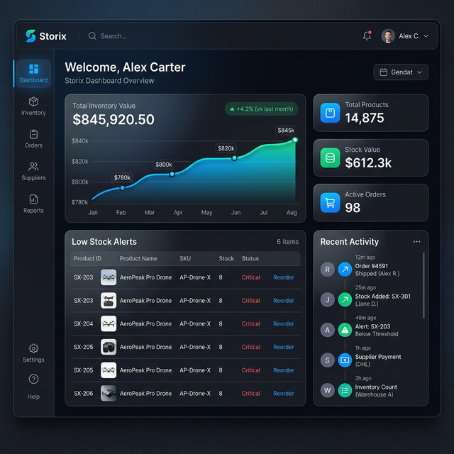

# Storix - Modern Inventory Management

Storix is a powerful, privacy-focused inventory management and POS system that uses **Google Sheets as its database**. No backend setup, no database hosting—just your data, in your hands.



## ✨ Features

- **Google Sheets Integration**: Your spreadsheet is the primary database. Edit data directly in Sheets or via Storix.
- **Modern POS Terminal**: Fast, responsive point-of-sale with barcode support and digital invoices.
- **Inventory & Variants**: Support for sizes, colors, and complex stock tracking.
- **Real-time Analytics**: Live metrics on stock value, sales performance, and low-stock alerts.
- **Privacy First**: Data stays in your Google account. No third-party database mirrors.
- **Multi-device Sync**: Since it uses Google Sheets, your data is instantly synced across all devices.

## 🚀 Getting Started

### Prerequisites
- A Google Account
- Node.js (v18+)

### Installation

1. Clone the repository:
   ```bash
   git clone https://github.com/praneth2580/Storix.git
   cd Storix
   ```

2. Install dependencies:
   ```bash
   npm install
   ```

3. Create a `.env` file based on `.env.example`:
   ```bash
   cp .env.example .env
   ```

4. Run the development server:
   ```bash
   npm run dev
   ```

## 🛠️ Configuration

To connect Storix to your Google Sheets:
1. Create a blank Google Spreadsheet.
2. Share it with the Google account you'll use to log in (or use your own).
3. Copy the **Spreadsheet ID** from the URL.
4. Paste it into the Storix connection prompt or settings.

## 📄 License

This project is open-source. See [LICENSE](LICENSE) for details.

---

Built with ❤️ by [Praneth](https://github.com/praneth2580)
